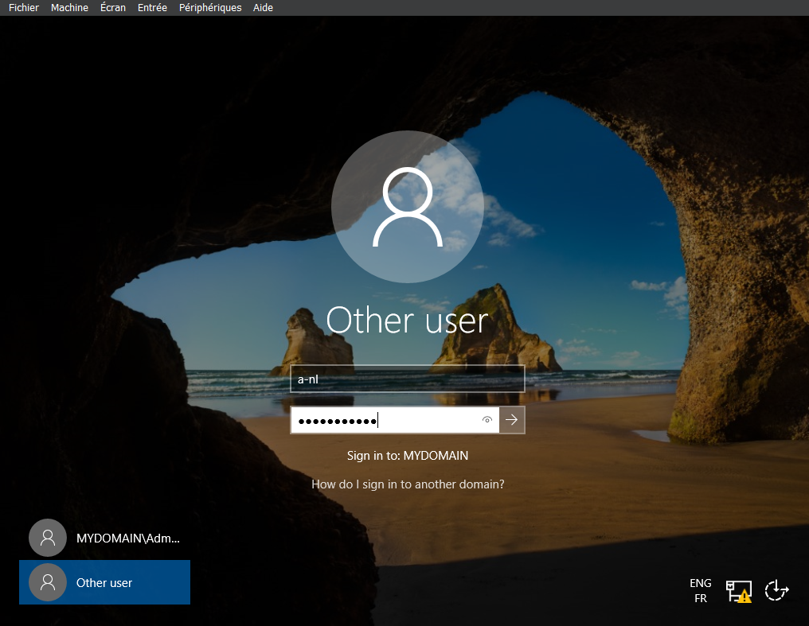
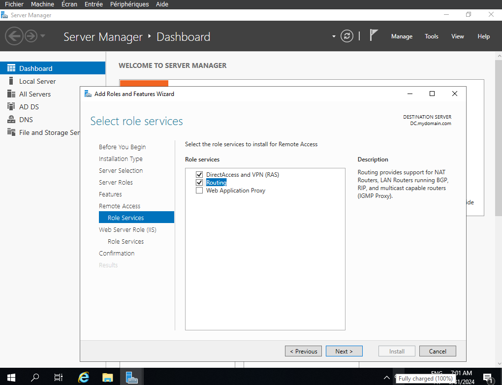
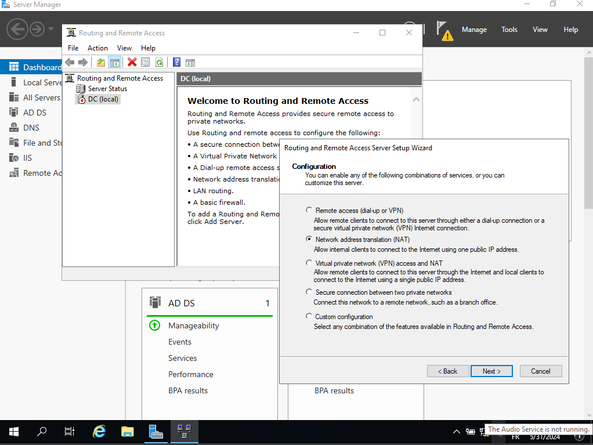
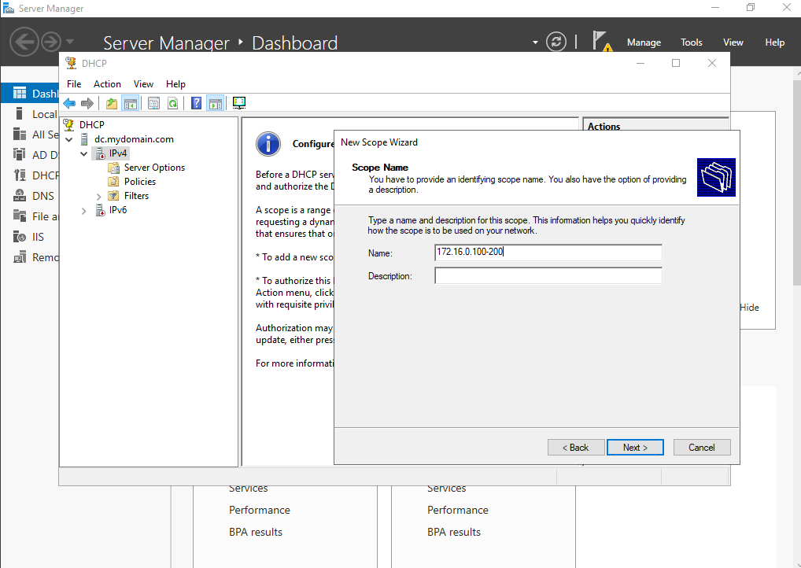
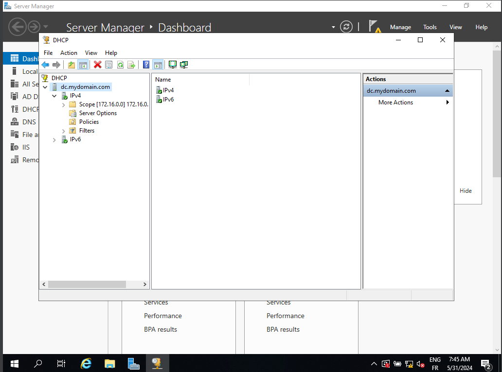
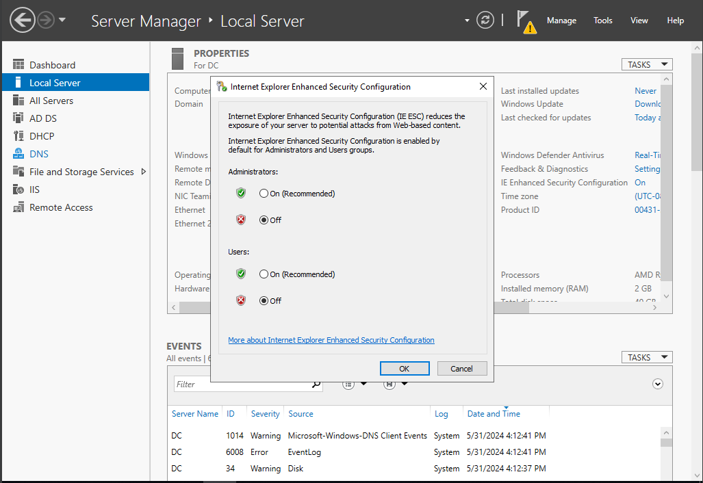
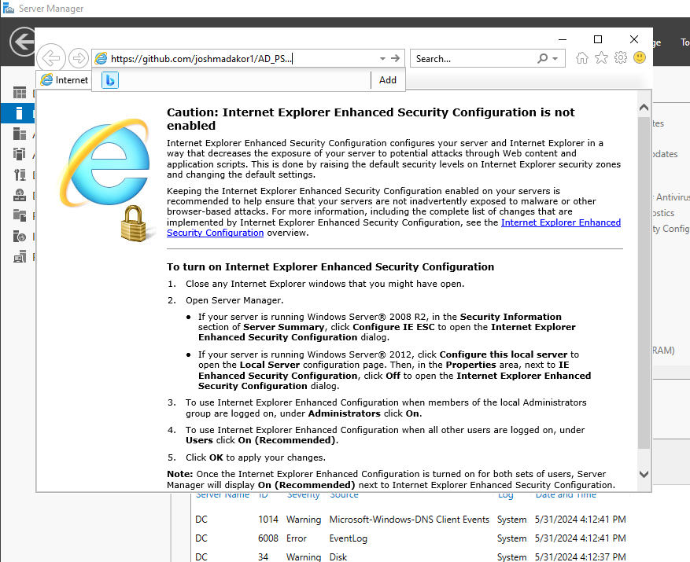
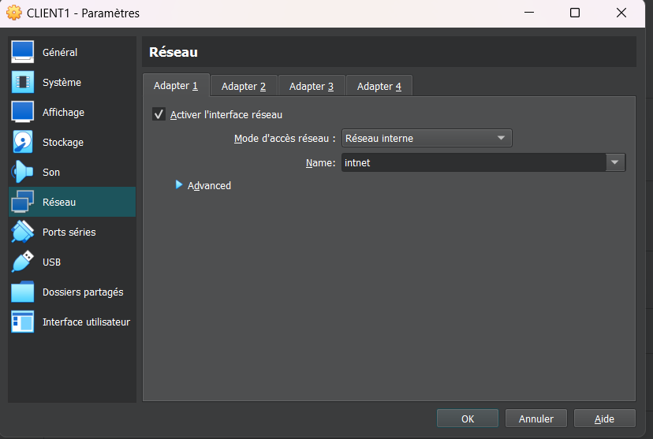

Tools for the LAB :

- Software oracle virtualbox which is what we're going to use to run our virtual machines
- A windows 10 iso and a server 2019 iso that we're going to use to install the two operating systems on two separate virtual machines
(In order to avoid licenses problem, create a blank virtual machine and then import the .vhd)

We are going to create our first virtual machine which is going to be our domain controller which is going to house active directory. We are going to give this virtual machine two network adapters one is going to be used to connect to the outside internet and the other one that's going to be used to connect to the virtual box a kind of private network that the clients are going to connect to.

After our virtual machine is created we're going to install server 2019 on it and then we're going to assign ip addressing for the internal network. The external network will automatically get ip addressing from the home network or like your home router so we don't have to worry about it. 

After we have ip addressing setup we're going to name the server and then we're going to install active directory and create our domain through the server manager window (installation of an Active Directory Domain Services ).

We'll notice there's this little flag, we have to do our post deployment configuration. We installed the software for active directory domain services but we didn't actually create the domain yet so we'll click this to promote this computer.2 domain and we are going to say add new forest and then we can name the domain mydomain.com. (go next until install)

Now we're we're actually going to create our own dedicated domain admin account instead of using the built-in administrator account by going to start and then administrative tools and then active directory users and computers.

Here mydomain.com is our newly created domain so let's just create an organizational unit to put our admin account in as kind of a folder in active directory for now so we'll name it, we will create a new user in a lot of organization is is like a dash name to signify this as an admin account.

We will right click it and go to properties and we'll go to member of and i'll say add and then we'll say domain admins and we'll say check we see it resolves to domain admin so we'll say apply.

Now we have our very own domain admin account so to use this let's go ahead and log out of the domain controller so we'll say sign out and then we'll do our control alt delete again and then instead of logging into this administrator one we're going to go to other user and we see it says sign into my domain

The next thing we're going to do is install raz slash nat that's like remo access server network address network address translation the purpose of this is to allow when we create our windows 10 client it's going to allow this client to be on this kind of private virtual network but still be able to access the internet through the domain controller so we're going to install nap like raz and nat on the domain controller to allow our clients to do that so to do this we will go to add roles and features and add remot access. go next and install routing

Then in the server manager window, we we can go to tools and then go to routing and remote access. Right click and go to configure and enable we'll say next and then we want to install nat to allow internal clients to connect to the internet using one address :

So we'll choose the internet interface and we'll say next and say finish take a little bit cool and now we see this thing is green and it has this like little arrow that's up and so this is configured totally.

the next thing we're going to do is we're going to set up a dhcp server on our domain controller with this scope information and i'll kind of explain that in a little bit but what this is going to do is allow our windows 10 clients to get an ip address that will let them get on the internet and browse the internet even though they're on this kind of private internal network just like in your office or school.

So to set up our dhcp we'll go back to the domain controller we'll go to add roles and we'll say next this is our server you'll notice the name changed to like dc.something so we'll say next and then we're going to select dhcp and add features and next next next install again.

When the istallation is donne, we can go to tools and dhcp and we can set up our scope. The whole purpose of dhcp is to allow you know computers on the network like client computers on the network to automatically get their ip addresses. so looking at our first diagram, we defined the scope as we're gonna we're gonna create a scope that will give the ip addresses in this range this 172.16.0.100 to 200 with this subnet mask.  We're going to right click one and we're going to say new scope ip range is so i'll just name this once in default 16.0.100 through 200 because that's that's our range we're going to use i'll say next the star address is 172.16.0.100. 16.0.200 

 it's saying to add an ip address for a router used by clients to enter the address below so if we look at our network diagram here we see that we configured nat on the domain controller and the domain controller has like routing configured as well so its job is to amongst other things like forward traffic from the clients to the internet so because of this the clients are going to use this internal nick of the domain controller as their default gateway slash router so going back to our dhcp configuration we're just going to enter the domain controller's ip address. what do you want to use for your your domain server or your dns server again when you install active directory on the domain controller it automatically installs dns and so because of that we're going to use the domain controller as our dns server well we essentially have to do that or we can't join the domain in this case. You may have to um right click the dhcp server up here and say authorize so we'll do that and then right click this one more time and say refresh and then we can see our ipv4 thing turned green

Go back to the um the domain controller here and then we have to make a configuration that lets us browse the internet from the domain controller usually you don't want to do this unlike a production environment but we're just in a lab so we're going to click configure this local server and then we're going to disable this internet explorer enhanced security thing right here 

Before we actually go and create our create our client computer and like join it to the domain and all that first we're going to um use our powershell script to create a whole bunch of users in active directory so we can kind of have a bunch of sample users

Now that we have all of our users created and our whole environment set up let's let's look at our network diagram again here really quick so we pretty much have everything set up here our internet is is connected 

Then we're going to configure that and routing so the clients on the private network can reach the internet through the domain controller next we're going to set up a dhcp on the domain controller so when we create our windows 10 machine it can automatically get an ip address and then the last thing we do on the domain controller before we create our client virtual machine is we're going to run a powershell script that will automatically create a thousand users in active directory and i'll kind of go through the script a little bit to explain what each line is so you can kind of get an intuition on how powershell is useful and like what kind of things you can use it for after creating the users we're going to create another virtual machine and install windows 10 on it and that virtual machine will be connected to the private virtual box network we're going to name that machine client1 and join it to the domain and then we're going to log into it with one of our domain accounts at this point our tutorial is going to be pretty much concluded so this environment we're building is a pretty basic windows networking environment with active directory and then just a few networking services
