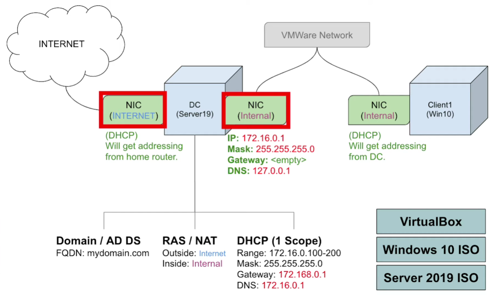
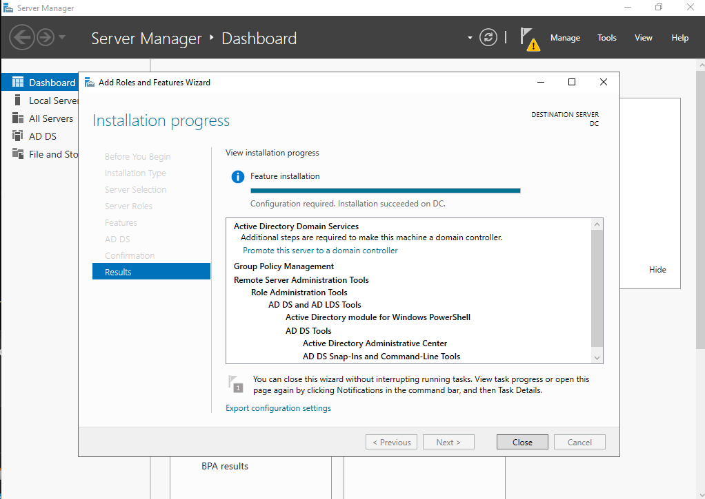
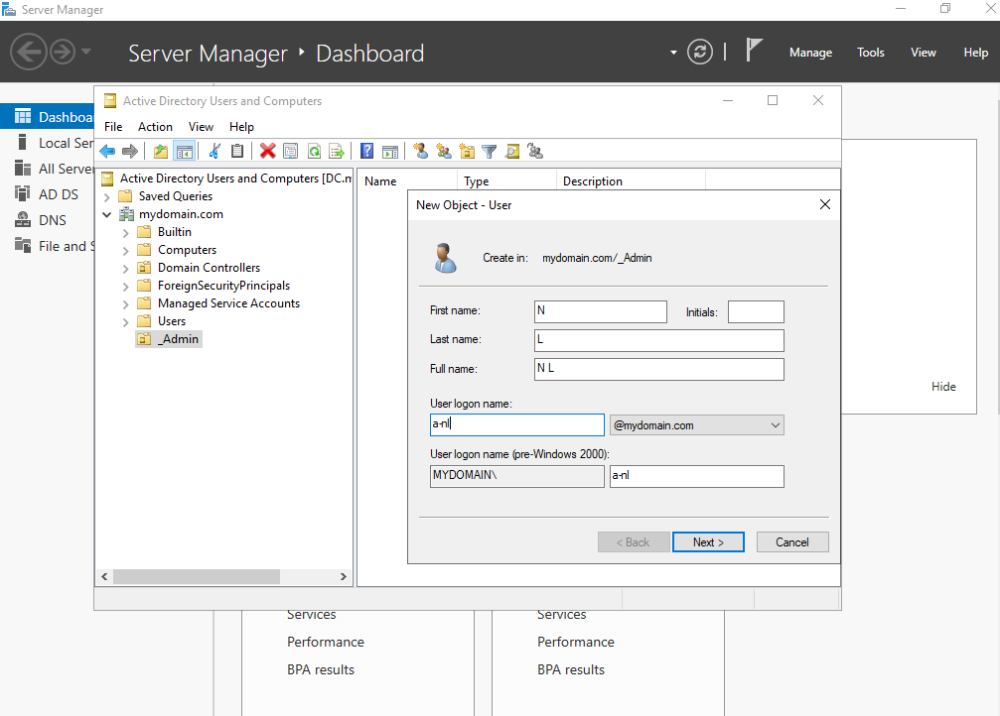
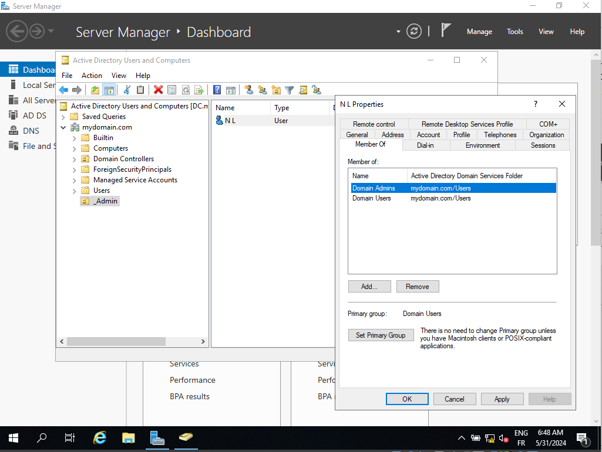

Tools for the LAB :

- Software oracle virtualbox which is what we're going to use to run our virtual machines
- A windows 10 iso and a server 2019 iso that we're going to use to install the two operating systems on two separate virtual machines
(In order to avoid licenses problem, create a blank virtual machine and then import the .vhd)

We are going to create our first virtual machine which is going to be our domain controller which is going to house active directory. We are going to give this virtual machine two network adapters one is going to be used to connect to the outside internet and the other one that's going to be used to connect to the virtual box a kind of private network that the clients are going to connect to.

After our virtual machine is created we're going to install server 2019 on it and then we're going to assign ip addressing for the internal network. The external network will automatically get ip addressing from the home network or like your home router so we don't have to worry about it. 

After we have ip addressing setup we're going to name the server and then we're going to install active directory and create our domain through the server manager window (installation of an Active Directory Domain Services ).

We'll notice there's this little flag, we have to do our post deployment configuration. We installed the software for active directory domain services but we didn't actually create the domain yet so we'll click this to promote this computer.2 domain and we are going to say add new forest and then we can name the domain mydomain.com. (go next until install)

Now we're we're actually going to create our own dedicated domain admin account instead of using the built-in administrator account by going to start and then administrative tools and then active directory users and computers.

Here mydomain.com is our newly created domain so let's just create an organizational unit to put our admin account in as kind of a folder in active directory for now so we'll name it, we will create a new user in a lot of organization is is like a dash name to signify this as an admin account.

Then we're going to configure that and routing so the clients on the private network can reach the internet through the domain controller next we're going to set up a dhcp on the domain controller so when we create our windows 10 machine it can automatically get an ip address and then the last thing we do on the domain controller before we create our client virtual machine is we're going to run a powershell script that will automatically create a thousand users in active directory and i'll kind of go through the script a little bit to explain what each line is so you can kind of get an intuition on how powershell is useful and like what kind of things you can use it for after creating the users we're going to create another virtual machine and install windows 10 on it and that virtual machine will be connected to the private virtual box network we're going to name that machine client1 and join it to the domain and then we're going to log into it with one of our domain accounts at this point our tutorial is going to be pretty much concluded so this environment we're building is a pretty basic windows networking environment with active directory and then just a few networking services
